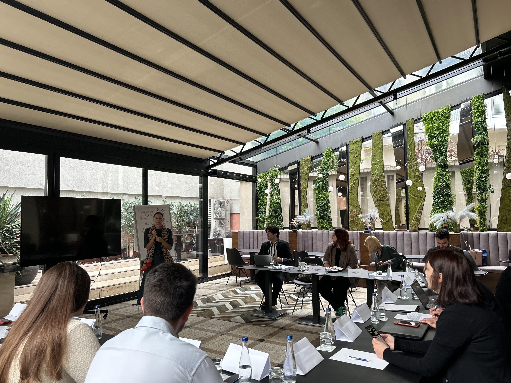
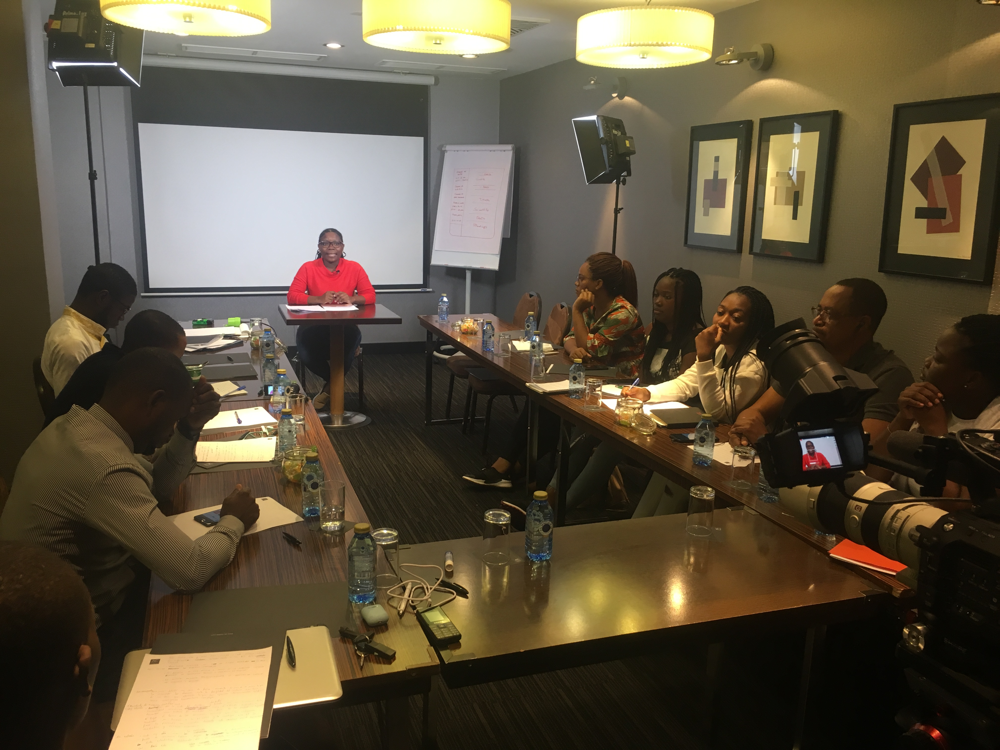
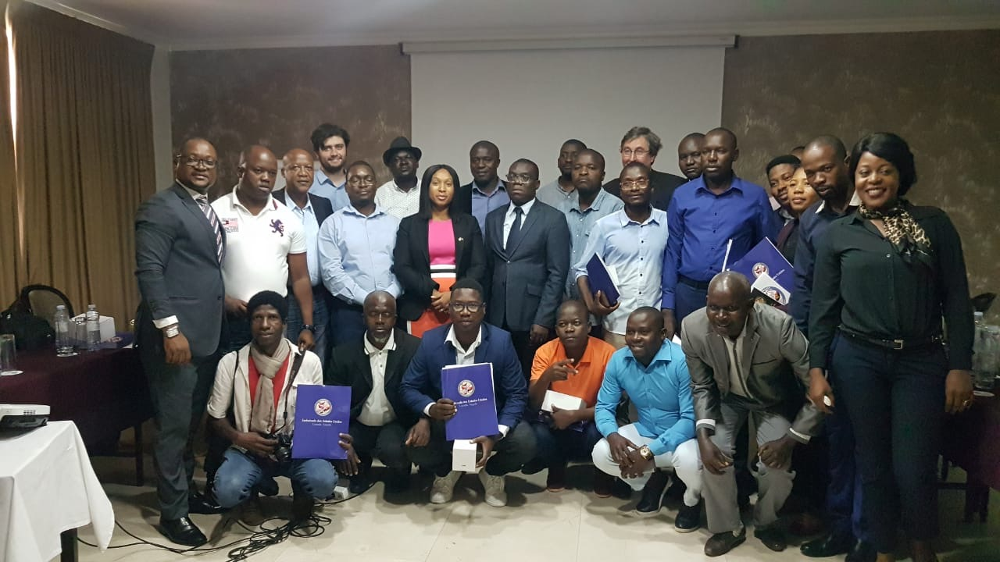

<section id="one">

<header class="major">
<h1>About Me</h1>
</header>

I'm a data analytics professional pursuing my MS in Business Analytics at Fordham University, bringing seven years of experience turning complex program data into actionable insights for government and international stakeholders.

My interest in data analytics grew out of seeing how central data-driven decision-making and evaluation are to effective international development, and how challenging it can be to fully integrate these practices into day-to-day program work. I became particularly drawn to data-focused learning and evaluation as ways to strengthen program design, support strategic decisions, and translate complex information for diverse stakeholders. This perspective motivated me to deepen my technical training, so I can contribute more intentionally to the kinds of analytical work I had long seen as essential to advancing impact.

<h2>My Journey</h2>

<h3>Democracy Building in the Western Balkans</h3>

From 2022 to 2025, I worked at the <strong>National Democratic Institute</strong> on a $15M+ portfolio of democracy programs across the Western Balkans, focusing on electoral integrity, legislative strengthening, and politcal inclusion.  What drew me deepest into this work was the challenge of measuring something as important, yet intangible, as democratic progress, and making that data meaningful to the people who could act on it.

One of my proudest contributions was leading the cumulative evaluation of a four-year electoral integrity program. I traveled across the region conducting stakeholder interviews, synthesized years of program data, and presented findings directly to U.S. Government donors. The work reinforced my belief that rigorous analysis only matters if you can communicate it clearly to decision-makers.

I also had the opportunity to contribute to publications exploring electoral systems and disinformation challenges in the region:

<ul>
<li><a href="https://www.agora-parl.org/resources/library/north-macedonias-election-system-how-ensure-fair-representation-parliament" target="_blank">North Macedonia's Election System: How to Ensure Fair Representation in Parliament</a></li>
<li><a href="https://www.ndi.org/sites/default/files/DISICON%207th%20edition_cc.pdf" target="_blank">DISICON 7th Edition - Disinformation Conference Proceedings</a></li>
</ul>

<h3>Global Media Development</h3>

Before NDI, I spent four years at <strong>IREX</strong> coordinating international journalism and media programs. This is where I first got hands-on experience with data visualization—managing live Power BI dashboards for external stakeholders and learning how to present complex program metrics in ways that resonated with diverse audiences.

The work took me to Moldova, Central Asia, Angola, and Spain, where I coordinated field activities and built relationships with local partners. These experiences taught me that data collection isn't just a technical exercise but requires understanding context, building trust, and designing systems that work for the people using them.

Some of the programs I supported during this time:

<ul>
<li><a href="https://www.irex.org/project/design-hub-information-central-asia#component-id-959" target="_blank">Design Hub for Information in Central Asia</a></li>
<li><a href="https://www.irex.org/project/investing-african-journalism-iaj" target="_blank">Investing in African Journalism (IAJ)</a></li>
</ul>

<!-- Add your own image from Angola or other field work here -->

<h3>Where It All Started</h3>

My interest in data began before I realized it had a name. At <strong>TechnoServe</strong>, I researched alternative energy businesses as solutions to poverty. As a <strong>Fundraising Intern</strong> at the U.S. WWI Centennial Commission, I built donor databases and wrote research briefs. Even as a college <strong>Economics Tutor</strong>, I was helping others understand data-driven reasoning.

Looking back, the thread connecting all of this work is clear: I'm drawn to projects where analytical rigor meets real-world application, and where the best insights come from understanding both the numbers and the people behind them.

<h2>What Drives Me</h2>

I believe data has the power to tell stories that drive change. Whether measuring the impact of democracy programs in the Balkans or predicting music trends with machine learning, I'm drawn to projects where analytical rigor meets real-world application. My international development background taught me that the best analysis means nothing if you can't ask the relevant questions or communicate findings clearly.

<ul class="actions">
<li><a href="projects.html" class="button next">View My Projects</a></li>
<li><a href="resume.html" class="button">See My Resume</a></li>
</ul>

</section>

