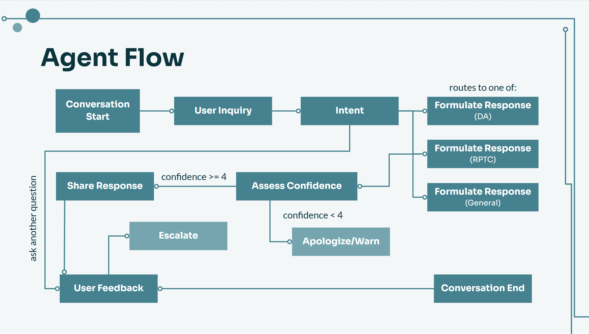

<section id="one">

<header class="major">
<h1>United Nations DESA - Cidy Knowledge Hub</h1>
</header>

<h2>Project Overview</h2>

Cidy is an AI assistant built for UN DESA's Capacity Development Programme Management Office (CDPMO). It routes a staff member's question to the right internal knowledge source, drafts a cited answer, scores its own confidence, and escalates to a human when that confidence is low. The system supports the UN 2.0 and UN 80 modernization visions by making scattered institutional knowledge searchable and reusable.

<h3>Tools Used</h3>
<ul>
<li>Microsoft Copilot Studio</li>
<li>Power Automate</li>
<li>Conversational AI / NLP</li>
</ul>

<h3>Capabilities</h3>
<ul>
<li>Source routing across funding streams</li>
<li>Cited answer drafting</li>
<li>Confidence self-scoring</li>
<li>Human-in-the-loop escalation</li>
</ul>

<h2>Background</h2>

Cidy began as a Fordham capstone project built in collaboration with the UN in early 2026. The prototype was strong enough that the work continued in-house, and development moved directly into UN DESA to mature it into a live tool for the department.

<h2>How It Works</h2>

The assistant sits on top of a knowledge base of roughly two hundred country-data documents plus guidelines, templates, and multi-year progress reports, segmented by funding stream and topic area so answers stay grounded in the right context. A set of Power Automate pipelines converts messy, scattered institutional files into structured, queryable databases and keeps them current, which is what lets Cidy cite specific internal sources rather than guess. The design targets concrete daily tasks: pulling similar past work when writing proposals, surfacing lessons learned without scrolling through scattered reports, locating the correct guideline or template, and answering the recurring annual funding questionnaire from a database of prior answers.

<h2>Results</h2>

Across six build iterations with rigorous A/B testing of methods and models, retrieval accuracy rose from roughly 55 percent to over 95 percent. The gains came from simplifying an overly complex flow, changing how knowledge was ingested and reorganized inside the databases, and revising prompting. The delivered prototypes secured directorial approval and funding to continue implementation, and the tool is now piloting with an initial team ahead of a planned department-wide rollout.

<!-- Add architecture diagram or interface screenshots here when cleared for sharing:

-->

<ul class="actions">
<li><a href="projects.html" class="button">Back to Projects</a></li>
</ul>

</section>

