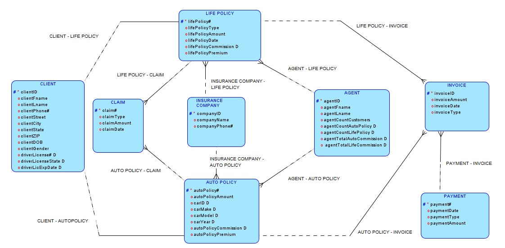

<section id="one">

<header class="major">
<h1>Insurance Agency Database System</h1>
</header>

<h2>Project Overview</h2>

A comprehensive database solution for tracking insurance company policies, built as part of a team project at Fordham University's Gabelli School of Business. The system manages clients, agents, auto policies, life policies, claims, invoices, and payments.

<h3>Tools Used</h3>
<ul>
<li>Oracle Data Modeler</li>
<li>Oracle APEX</li>
<li>SQL / PL/SQL</li>
</ul>

<h3>Skills Demonstrated</h3>
<ul>
<li>Entity-Relationship Modeling</li>
<li>Database Normalization (3NF)</li>
<li>DDL Script Development</li>
<li>Complex SQL Queries</li>
</ul>

<h2>Database Design</h2>

The database was designed following a structured approach: conceptual modeling, logical modeling, and physical implementation. Key entities include Client, Agent, Auto Policy, Life Policy, Claim, Invoice, and Payment.

<h3>Normalization</h3>

All tables were normalized to Third Normal Form (3NF). Notable decisions included:

<ul>
<li>Separating Car and Driver information from the Client-Auto Policy relationship to eliminate partial dependencies</li>
<li>Removing calculated fields (commissions, counts) from junction tables</li>
<li>Creating a Car_2 table to resolve transitive dependency between Car Make and Car Model</li>
</ul>

<h2>Sample Queries</h2>

The project included 12 complex SQL queries demonstrating joins, calculations, subqueries, and aggregations. Examples:

<ul>
<li>Multi-table joins linking clients, policies, and agents</li>
<li>Calculated fields for total invoiced vs. total paid amounts</li>
<li>Date comparisons to identify policies needing renewal within 14 days</li>
<li>Nested subqueries comparing individual policy amounts to global averages</li>
</ul>

<h2>APEX Implementation</h2>

The database was implemented in Oracle APEX with a functional web interface for data entry and reporting.

<!-- Add APEX screenshots here -->
<!--  -->

<ul class="actions">
<li><a href="projects.html" class="button">Back to Projects</a></li>
</ul>

</section>

