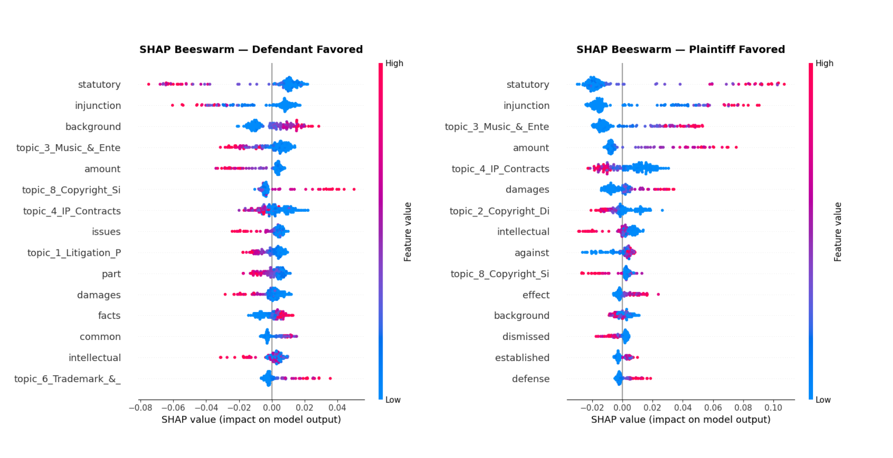

<section id="one">

<header class="major">
<h1>Predicting IP Litigation Outcomes</h1>
</header>

<h2>Project Overview</h2>

This project treats a corpus of intellectual-property court opinions as text data to ask a single question: can case outcomes be predicted from judicial language alone? It pits traditional machine-learning classifiers against modern legal transformer models and adds an interpretability layer to understand what drives each prediction.

<h3>Tools Used</h3>
<ul>
<li>Python</li>
<li>Scikit-learn &amp; XGBoost</li>
<li>LegalBERT, RoBERTa, Longformer</li>
<li>SHAP</li>
</ul>

<h3>Techniques</h3>
<ul>
<li>Text classification</li>
<li>TF-IDF &amp; topic modeling</li>
<li>Transformer fine-tuning</li>
<li>Model interpretability</li>
<li>LLM-assisted labeling</li>
</ul>

<h2>Approach</h2>

The study compares two families of models on the same task. On one side are traditional classifiers, Random Forest and XGBoost, trained on features built from TF-IDF and topic modeling. On the other are legal-domain transformer models, LegalBERT, RoBERTa, and Longformer, which read the opinion text directly. SHAP is applied to surface which language most influences the model's decisions, keeping the results interpretable rather than a black box.

Labeling case outcomes across a large corpus is normally the expensive bottleneck in work like this, so the project introduces a low-cost LLM pipeline that labels outcomes at scale, making the larger comparison feasible.

<h2>Results</h2>

<!-- Add headline results here: best-performing model, its accuracy / F1 / AUC,
     and a note on whether transformers beat the traditional classifiers.
     Optionally add a SHAP or model-comparison figure:

-->

The comparison highlights the trade-off between traditional classifiers, which are fast and interpretable, and legal transformers, which read raw opinion text at the cost of complexity, with SHAP used throughout to keep the winning approach explainable.

<ul class="actions">
<!-- Add the repo link when ready:
<li><a href="GITHUB_REPO_URL" class="button special">View on GitHub</a></li>
-->
<li><a href="projects.html" class="button">Back to Projects</a></li>
</ul>

</section>

