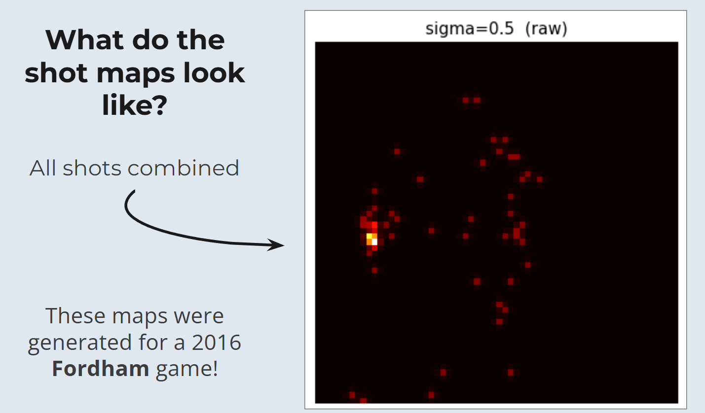

<section id="one">

<header class="major">
<h1>March Madness Predictor</h1>
</header>

<h2>Project Overview</h2>

A multimodal system that predicts the outcome of any possible NCAA tournament matchup across all 68 teams, generating 2,278 calibrated pairwise win probabilities. Built by a four-person team ("Backprop Ballers") for the Deloitte-sponsored Fordham March Data Crunch Madness competition, where it took first place against a field of roughly fifteen teams.

<h3>Tools Used</h3>
<ul>
<li>Python</li>
<li>TensorFlow</li>
<li>Scikit-learn</li>
</ul>

<h3>Techniques</h3>
<ul>
<li>Siamese convolutional neural network</li>
<li>Feature-Tokenizer Transformer</li>
<li>Feature engineering &amp; pruning</li>
<li>Probability calibration</li>
</ul>

<h2>Approach</h2>

The core idea was to give the model something box scores cannot capture: a team's spatial shooting signature. A Siamese convolutional neural network learns each team's identity from 64x64x3 Gaussian shot-map heatmaps, and those learned embeddings are fused with engineered box-score and matchup features inside a Feature-Tokenizer Transformer that outputs a calibrated win probability for every possible game.

The CNN was trained on 2,076,888 shots spanning 19,038 games, 577 teams, and 10 seasons, while the tabular side drew on 1,514 tournament games from 2002 to 2025.

<h2>Rigor</h2>

Getting a trustworthy result took as much cleanup as modeling. An orientation-leakage bug was fixed with a 50/50 team swap so the model could not cheat off court orientation. Features were pruned with correlation and VIF checks down to 23 clean inputs, and 30 model variants (ten families across three ablations) were grid-searched and compared on a unified 2023 to 2025 evaluation window.

<h2>Results</h2>

The final model, the Feature-Tokenizer Transformer with CNN heatmap features, reached a log loss of 0.5437, a ROC-AUC of 0.8023, accuracy of 74.5 percent, and an F1 of 0.703. Adding the CNN shot-map features gave a 3.83 percentage-point accuracy lift over the same model without them, confirming that spatial shooting signatures carried real predictive signal.

<h3>My Contribution</h3>

I owned the CNN shot-map pipeline end to end: sourcing shot-location data through APIs, rendering the 64x64x3 Gaussian heatmaps, training the Siamese CNN, and generating the learned shot-profile features that gave the final model its edge.

<ul class="actions">
<li><a href="https://www.fordham.edu/gabelli-school-of-business/industry-collaborations/engagement-and-expertise-/march-data-crunch-madness/" class="button special">About the Competition</a></li>
<!-- Add the repo link when ready:
<li><a href="GITHUB_REPO_URL" class="button">View on GitHub</a></li>
-->
<li><a href="projects.html" class="button">Back to Projects</a></li>
</ul>

</section>

