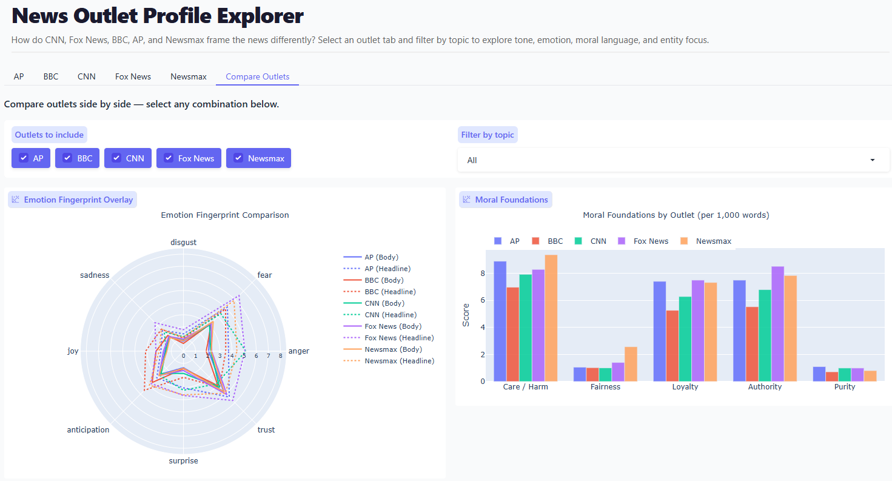

<section id="one">

<header class="major">
<h1>Multi-Dimensional News Coverage Profiles</h1>
</header>

<h2>Project Overview</h2>

Most media-bias tools collapse an outlet into a single left-right score. This project builds multi-dimensional coverage profiles instead, combining distinctive vocabulary, sentiment, emotion, moral-foundations, sub-theme, and named-entity analysis to capture not just where an outlet leans but how it frames a story. The study spans five outlets across five contested topics and ships as both a written research paper and a public interactive web app.

<h3>Tools Used</h3>
<ul>
<li>Python</li>
<li>Scikit-learn</li>
<li>spaCy &amp; NLTK</li>
<li>Plotly</li>
<li>Hugging Face Spaces</li>
</ul>

<h3>Methods</h3>
<ul>
<li>TF-IDF distinctive vocabulary</li>
<li>VADER sentiment</li>
<li>NRC discrete-emotion scoring</li>
<li>Moral Foundations scoring</li>
<li>Non-negative matrix factorization (NMF)</li>
<li>Named-entity recognition</li>
</ul>

<h2>The Data</h2>

The corpus covers five outlets chosen to span the mainstream and partisan press: CNN, BBC, AP, Fox News, and NewsMax, each analyzed across five contested topics. Article metadata was collected through the MediaCloud API across every keyword and outlet pairing, producing 19,554 records. Those records were deduplicated and balance-sampled down to roughly 3,000 candidate URLs, then scraped for full text with trafilatura and cleaned into a final modeling corpus of 2,334 articles.

<h2>Approach</h2>

Rather than reduce each outlet to one number, the pipeline profiles coverage along six complementary axes. TF-IDF surfaces the vocabulary that most distinguishes one outlet's coverage of a topic from another's. VADER measures sentiment polarity, and NRC discrete-emotion scoring breaks that further into emotions such as fear, anger, and trust. Moral Foundations scoring maps the moral vocabulary each outlet reaches for. A per-topic non-negative matrix factorization extracts the recurring sub-themes within a topic, and spaCy named-entity recognition tracks which people, organizations, and places each outlet foregrounds.

Layering these methods together produces a coverage fingerprint for any outlet-topic combination, and the interactive app lets a reader explore and compare those fingerprints directly.

<h2>Key Findings</h2>

The multi-dimensional view exposes framing differences that a single left-right rating hides. Headline emotion diverged sharply between outlets on the same events, moral-vocabulary outliers appeared where an outlet's word choice broke from the pack, and entity emphasis shifted the apparent subject of a story from one outlet to the next. These are exactly the signals a one-axis bias score flattens away.

<!-- Add screenshots of the interactive app and sample coverage-profile visualizations here:

-->

<ul class="actions">
<li><a href="https://huggingface.co/spaces/Jack-O-Wood/news-outlet-profiles" class="button special">Try the App</a></li>
<!-- Add the repo link when ready:
<li><a href="GITHUB_REPO_URL" class="button">View on GitHub</a></li>
-->
<li><a href="projects.html" class="button">Back to Projects</a></li>
</ul>

</section>

