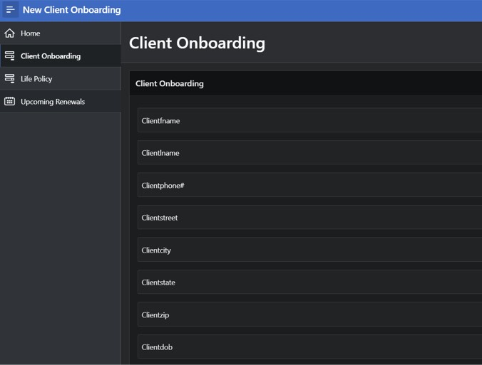
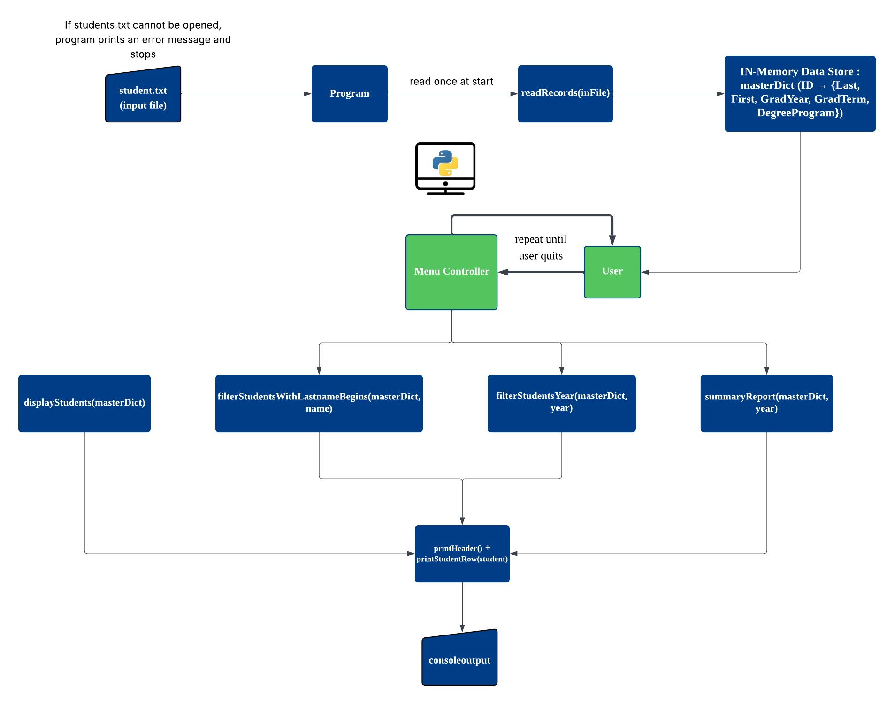

<section id="one">

<header class="major">
<h1>Projects</h1>
</header>

A collection of projects demonstrating skills in machine learning, Python development, and database design.

</section>

<section id="two" class="spotlights">

<section>

<header class="major">
<h3>Spotify Song Popularity Predictor</h3>
</header>

A machine learning project that combines Spotify audio features with historical Billboard chart data to predict whether a song achieves commercial success. The model uses gradient-boosted trees (XGBoost) and SHAP-based interpretability to surface which musical attributes most influence hit likelihood across eras.

<strong>Tools:</strong> Python, Scikit-learn, Pandas, XGBoost

<ul class="actions">
<li><a href="spotify-ml.html" class="button">More Details</a></li>
</ul>

</section>

<section>

<header class="major">
<h3>Insurance Agency Database System</h3>
</header>

Comprehensive database solution for tracking insurance policies, claims, and payments. Features entity-relationship modeling, normalization to 3NF, and a functional Oracle APEX web interface.

<strong>Tools:</strong> Oracle Data Modeler, Oracle APEX, SQL

<ul class="actions">
<li><a href="insurance-db.html" class="button">More Details</a></li>
</ul>

</section>

<section>

<header class="major">
<h3>Student Database Management System</h3>
</header>

Python-based database application for managing student records. Demonstrates object-oriented programming, data structures, and database connectivity fundamentals.

<strong>Tools:</strong> Python, SQL

<ul class="actions">
<li><a href="student-db.html" class="button">More Details</a></li>
</ul>

</section>

</section>

