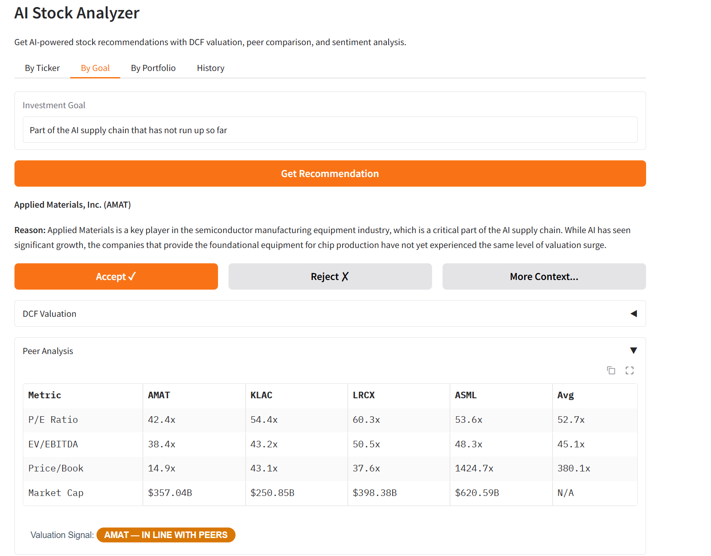

<section id="one">

<header class="major">
<h1>Projects</h1>
</header>

A collection of projects demonstrating skills in machine learning, Python development, and database design.

</section>

<section id="two" class="spotlights">

<section>

<header class="major">
<h3>Multi-Dimensional News Coverage Profiles</h3>
</header>

Most media-bias tools collapse a news outlet into a single left–right score. This project builds multi-dimensional coverage profiles instead, combining distinctive-vocabulary, sentiment, emotion, moral-foundations, sub-theme, and named-entity analysis to capture not just where an outlet leans but how it frames the news. It spans five outlets across five contested topics, paired with an interactive web app that lets readers explore any outlet–topic combination.

<strong>Tools:</strong> Python, Scikit-learn, spaCy, NLTK, Plotly

<ul class="actions">
<li><a href="news-coverage-profiles.html" class="button">More Details</a></li>
</ul>

</section>

<section>

<header class="major">
<h3>United Nations DESA — Cidy Knowledge Hub</h3>
</header>

An AI assistant ('Cidy') for UN DESA's Capacity Development Programme Management Office. Cidy routes a staff member's question to the right internal knowledge source, drafts a cited answer, scores its own confidence, and escalates to a human when confidence is low, built on a knowledge base segmented by funding stream and topic area. Supports the UN 2.0 and UN 80 visions.

<strong>Tools:</strong> MS Copilot Studio, AI/NLP, Conversational AI

<ul class="actions">
<li><a href="cidy-knowledge-hub.html" class="button">More Details</a></li>
</ul>

</section>

<section>

<header class="major">
<h3>March Madness Predictor</h3>
</header>

A multimodal system that predicts the outcome of any possible NCAA tournament matchup across all 68 teams. A Siamese convolutional neural network learns each team's spatial shooting signature from shot-map heatmaps, and those learned embeddings are fused with engineered box-score and matchup features inside a Feature-Tokenizer Transformer that outputs a calibrated win probability for every game.

<strong>Tools:</strong> Python, TensorFlow, CNNs, Transformers, Scikit-learn

<ul class="actions">
<li><a href="march-madness.html" class="button">More Details</a></li>
</ul>

</section>

<section>

<header class="major">
<h3>Predicting IP Litigation Outcomes</h3>
</header>

Treats a corpus of intellectual-property court opinions as text data to ask whether case outcomes can be predicted from judicial language. It compares traditional classifiers (Random Forest, XGBoost) against legal transformer models (LegalBERT, RoBERTa, Longformer), engineers features with TF-IDF and topic modeling, applies SHAP for interpretability, and introduces a low-cost LLM pipeline for labeling case outcomes at scale.

<strong>Tools:</strong> Python, Scikit-learn, XGBoost, LegalBERT, SHAP

<ul class="actions">
<li><a href="ip-litigation.html" class="button">More Details</a></li>
</ul>

</section>

<section>

<header class="major">
<h3>Spotify Song Popularity Predictor</h3>
</header>

A machine learning project that combines Spotify audio features with historical Billboard chart data to predict whether a song achieves commercial success. The model uses gradient-boosted trees (XGBoost) and SHAP-based interpretability to surface which musical attributes most influence hit likelihood across eras.

<strong>Tools:</strong> Python, Scikit-learn, XGBoost, Pandas, SHAP

<ul class="actions">
<li><a href="spotify-ml.html" class="button">More Details</a></li>
</ul>

</section>

<section>

<header class="major">
<h3>AI Stock Recommender</h3>
</header>

An AI-powered financial analytics app that generates personalized stock recommendations, synthesizing fundamental analysis, historical pricing trends, and news-sentiment analysis against user-defined preferences like industry, market cap, and risk tolerance.

<strong>Tools:</strong> Python, Gemini API, NLP, Pandas

<ul class="actions">
<li><a href="ai-stock-recommender.html" class="button">More Details</a></li>
</ul>

</section>

<section>

<header class="major">
<h3>Insurance Agency Database System</h3>
</header>

Comprehensive database solution for tracking insurance policies, claims, and payments. Features entity-relationship modeling, normalization to 3NF, and a functional Oracle APEX web interface.

<strong>Tools:</strong> Oracle Data Modeler, Oracle APEX, SQL

<ul class="actions">
<li><a href="insurance-db.html" class="button">More Details</a></li>
</ul>

</section>

<section>

<header class="major">
<h3>Student Database Management System</h3>
</header>

Python-based database application for managing student records. Demonstrates object-oriented programming, data structures, and database connectivity fundamentals.

<strong>Tools:</strong> Python, SQL

<ul class="actions">
<li><a href="student-db.html" class="button">More Details</a></li>
</ul>

</section>

</section>
<!-- Currently Working On -->
<section id="in-progress">

<header class="major">
<h2>Currently Working On</h2>
</header>

A project in active development

<table>
<thead>
<tr>
<th>Project</th>
<th>Description</th>
<th>Tools</th>
</tr>
</thead>
<tbody>
<tr>
<td><strong>Legislative Contagion</strong></td>
<td>Tracking the diffusion of authoritarian legislation through natural language processing. An NLP pipeline that detects when legislative language originating in one jurisdiction — such as authoritarian regimes or politically polarized US states — is adopted, adapted, or echoed in others, mapping the cross-border networks of originators, amplifiers, and adopters of restrictive policy language.</td>
<td>Python, NLP</td>
</tr>
</tbody>
</table>

</section>

