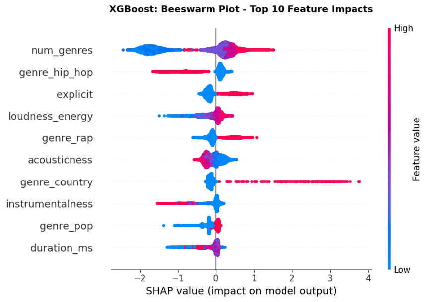
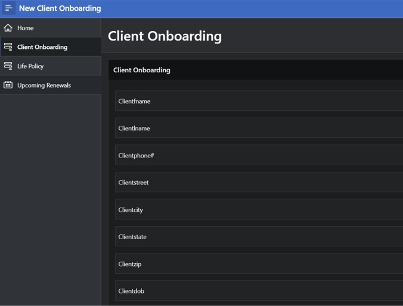
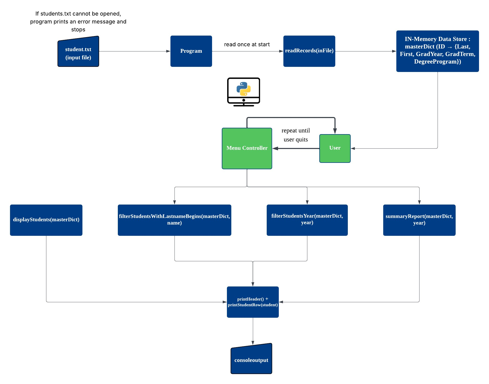

<section id="one">

<header class="major">
<h1>Projects</h1>
</header>

A collection of projects demonstrating skills in machine learning, Python development, and database design.

</section>

<section id="two" class="spotlights">

<section>

<header class="major">
<h3>Spotify Song Popularity Predictor</h3>
</header>

A machine learning project that combines Spotify audio features with historical Billboard chart data to predict whether a song achieves commercial success. The model uses gradient-boosted trees (XGBoost) and SHAP-based interpretability to surface which musical attributes most influence hit likelihood across eras.

<strong>Tools:</strong> Python, Scikit-learn, Pandas, XGBoost

<ul class="actions">
<li><a href="spotify-ml.html" class="button">More Details</a></li>
</ul>

</section>

<section>

<header class="major">
<h3>Insurance Agency Database System</h3>
</header>

Comprehensive database solution for tracking insurance policies, claims, and payments. Features entity-relationship modeling, normalization to 3NF, and a functional Oracle APEX web interface.

<strong>Tools:</strong> Oracle Data Modeler, Oracle APEX, SQL

<ul class="actions">
<li><a href="insurance-db.html" class="button">More Details</a></li>
</ul>

</section>

<section>

<header class="major">
<h3>Student Database Management System</h3>
</header>

Python-based database application for managing student records. Demonstrates object-oriented programming, data structures, and database connectivity fundamentals.

<strong>Tools:</strong> Python, SQL

<ul class="actions">
<li><a href="student-db.html" class="button">More Details</a></li>
</ul>

</section>

</section>
<!-- Currently Working On -->
<section id="in-progress">

<header class="major">
<h2>Currently Working On</h2>
</header>

A few projects in active development 

<table>
<thead>
<tr>
<th>Project</th>
<th>Description</th>
<th>Tools</th>
</tr>
</thead>
<tbody>
<tr>
<td><strong>UN DESA AI Knowledge Hub</strong></td>
<td>An AI-assisted platform ('Cidy') for UN DESA staff to streamline capacity development project design, planning, and monitoring. Combines a centralized knowledge hub with an on-demand AI assistant. Supports the UN 2.0 and UN 80 visions.</td>
<td>AI/NLP, Web Development</td>
</tr>
<tr>
<td><strong>March Madness Predictor</strong></td>
<td>A deep learning approach to NCAA tournament prediction using CNNs trained on team shot map data alongside traditional machine learning features.</td>
<td>Python, TensorFlow, CNNs</td>
</tr>
<tr>
<td><strong>AI Stock Recommender</strong></td>
<td>Group project building an AI-powered financial analytics app that generates stock recommendations by combining fundamental analysis, historical pricing, and news sentiment with user-defined preferences like industry, market cap, and risk tolerance.</td>
<td>Python, Gemini API, NLP</td>
</tr>
<tr>
<td><strong>IP Litigation Deep Learning</strong></td>
<td>A deep learning project analyzing intellectual property litigation case files. Scope and approach currently being defined.</td>
<td>Deep Learning, NLP</td>
</tr>
<tr>
<td><strong>NLP Project</strong></td>
<td>An upcoming natural language processing project. Currently in the topic selection phase.</td>
<td>Python, NLP</td>
</tr>
</tbody>
</table>

</section>

