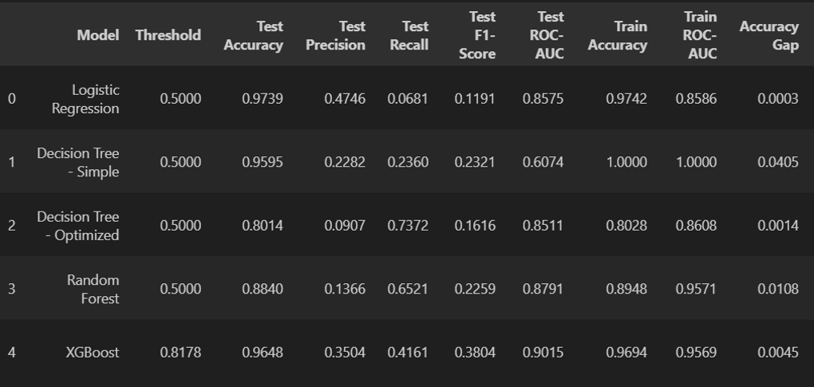
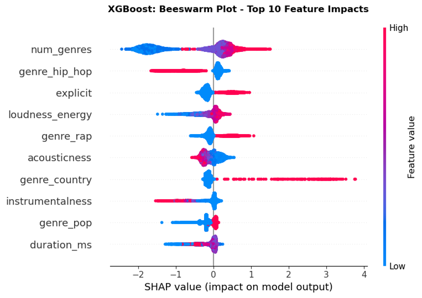
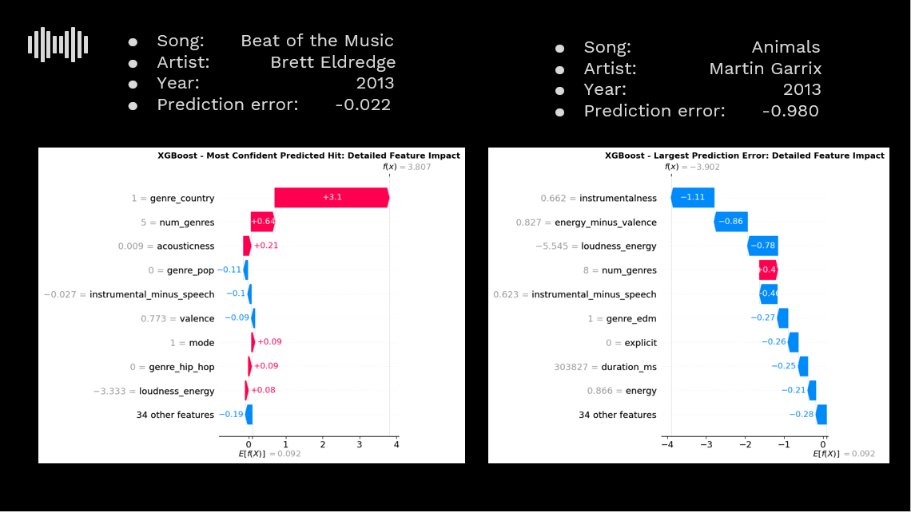
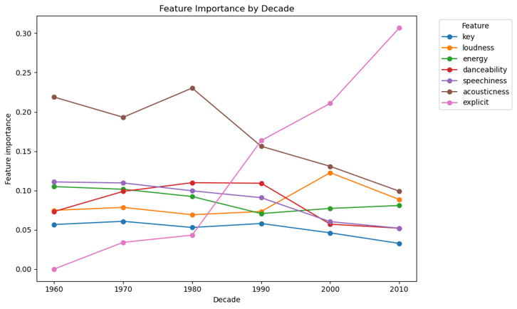

<section id="one">

<header class="major">
<h1>Spotify Song Popularity Predictor</h1>
</header>

<h2>Project Overview</h2>

The Spotify Playlist Rater combines Spotify audio features with external Billboard chart and metadata sources to evaluate how closely a playlist resembles historically successful tracks. The project applies machine learning, statistical analysis, and data visualization to translate complex model outputs into clear, user-facing insights.

<ul class="actions">
<li><a href="https://spotify-rater-ayfxxamk5zcfaqq47qhw88.streamlit.app/" class="button special">Try the App</a></li>
</ul>

<h3>Tools Used</h3>
<ul>
<li>Python</li>
<li>Pandas & NumPy</li>
<li>Scikit-learn</li>
<li>Matplotlib / Seaborn</li>
</ul>

<h3>Techniques</h3>
<ul>
<li>Exploratory Data Analysis</li>
<li>Feature Engineering</li>
<li>Classification / Regression</li>
<li>Model Evaluation</li>
</ul>

<h2>The Data</h2>

This project uses two publicly available music datasets from Kaggle. The primary source is the "Spotify Dataset 1921-2020, 600k+ Tracks," which contains audio and metadata for over <strong>600,000 unique tracks</strong> collected from the Spotify Web API, including detailed audio features such as danceability, energy, loudness, acousticness, instrumentalness, valence, tempo, key, mode, duration, and track popularity metrics, as well as artist and release year information.

The secondary source is the <strong>Billboard "The Hot 100" Songs</strong> dataset, a comprehensive collection of weekly Hot 100 chart entries from Billboard since the chart's inception in 1958, which includes artist names, track titles, chart dates, weekly ranks, and peak positions. These two datasets were merged by matching cleaned artist and track fields, and after filtering, deduplication, and feature engineering, the final modeling set includes tens of thousands of tracks annotated with chart success labels suitable for machine learning classification and trend analysis.

<h2>Approach</h2>

The modeling approach evolved significantly as limitations in the initial target definition became clear. The project began using the Spotify dataset alone, with the Spotify-provided popularity score used as the target variable. While early models trained successfully, exploratory analysis revealed that the popularity score was heavily biased toward recent listening activity, causing models to systematically favor newer tracks over historically successful songs.

This discovery led to a pivot toward a more stable and interpretable definition of success by incorporating historical Billboard Hot 100 chart data as the supervised learning target. Billboard chart data provided weekly rankings dating back to 1958, allowing song success to be defined relative to its own time period rather than modern streaming behavior.

Integrating this dataset introduced a new challenge: reliably matching tracks across Spotify and Billboard sources despite inconsistent naming conventions. This was addressed using fuzzy string matching with the RapidFuzz Python library, applied to cleaned artist and track title fields to construct a high-confidence merged dataset.

<h2>Model Performance</h2>

Multiple classification models were trained and compared, with attention paid to class imbalance and threshold selection.

XGBoost achieved the best balance of discrimination and interpretability, with a test ROC-AUC of <strong>0.90</strong> and a test F1-score of <strong>0.38</strong> at an optimized decision threshold of <strong>0.82</strong>. While logistic regression achieved high accuracy due to class imbalance, its recall and F1-score were substantially lower, confirming the importance of non-linear models for capturing complex interactions between musical features.

<h2>Key Findings</h2>

<h3>Feature Importance</h3>

SHAP analysis of the XGBoost model revealed which features had the largest impact on hit predictions:

Features related to loudness, energy, genre indicators (such as hip-hop, rap, and country), and the number of genres associated with an artist consistently had the largest impact. High loudness-energy combinations and explicit content increased hit likelihood, while higher acousticness and instrumentalness generally reduced it—indicating that charting songs tend to favor more produced, vocal-forward sound profiles.

<h3>Model Interpretability</h3>

Instance-level SHAP explanations revealed both model strengths and failure modes:

The most confident hit predictions were driven by strong genre alignment and high-energy audio characteristics, while the largest prediction errors often occurred for instrumental or genre-ambiguous tracks. These cases highlighted limitations in predicting commercial success for niche or cross-genre songs.

<h3>Temporal Trends</h3>

Decade-level feature analysis revealed how the drivers of musical success have shifted over time:

Acousticness and musical key were more influential in earlier decades, while explicit content, loudness, and production intensity became increasingly important from the 1990s onward. This supports the conclusion that successful music is not defined by static attributes, but by evolving production norms and audience preferences.

<ul class="actions">
<li><a href="https://spotify-rater-ayfxxamk5zcfaqq47qhw88.streamlit.app/" class="button special">Try the App</a></li>
<li><a href="https://github.com/Jack-O-Wood/spotify-rater" class="button">View on GitHub</a></li>
<li><a href="projects.html" class="button">Back to Projects</a></li>
</ul>

</section>

