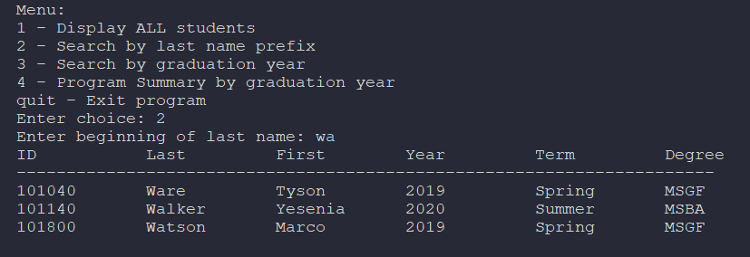

<section id="one">

<header class="major">
<h1>Student Database Management System</h1>
</header>

<h2>Project Overview</h2>

A menu-driven console application that reads a tab-delimited student records file and allows users to query and summarize student data.

<h3>Tools Used</h3>
<ul>
<li>Python</li>
</ul>

<h3>Skills Demonstrated</h3>
<ul>
<li>Object-Oriented Programming</li>
<li>Database Design</li>
<li>CRUD Operations</li>
<li>Data Validation</li>
</ul>

<h2>Features</h2>

<ul>
<li> 1 - Display all student records</li>
<li> 2 - Search by last name prefix</li>
<li> 3 - Search by graduation year</li>
<li> 4 - Generate summary report by graduation year</li>
</ul>

<h2>Technical Highlights</h2>

The program was developed using a structured, three-phase workflow (design, prototype, refinement) to ensure clarity, correctness, and robustness. Student records are stored using a nested dictionary data model, with student IDs serving as primary keys and individual attributes stored as inner dictionaries. This structure enables efficient filtering, iteration, and summary reporting while keeping the code modular and readable.

A key technical focus was improving usability and stability through formatted console output and defensive programming. Custom helper functions were implemented to produce fixed-width, tabular displays for student records, transforming raw dictionary output into a clean, professional presentation. Input validation and error handling were added throughout the program to safely manage malformed files, missing data, duplicate IDs, and invalid user input (such as non-numeric graduation years), ensuring the application remains stable under real-world data conditions.

Artificial Intelligence (AI) was used as a development aid to review code structure, identify potential failure points, and suggest improvements for formatting and exception handling. These insights helped strengthen functions responsible for file loading, user input validation, summary reporting, and menu control flow, resulting in a more resilient and user-friendly console application.

<ul class="actions">
<li><a href="https://github.com/Jack-O-Wood/student-records-query" class="button special">View on GitHub</a></li>
<li><a href="projects.html" class="button">Back to Projects</a></li>
</ul>

</section>

